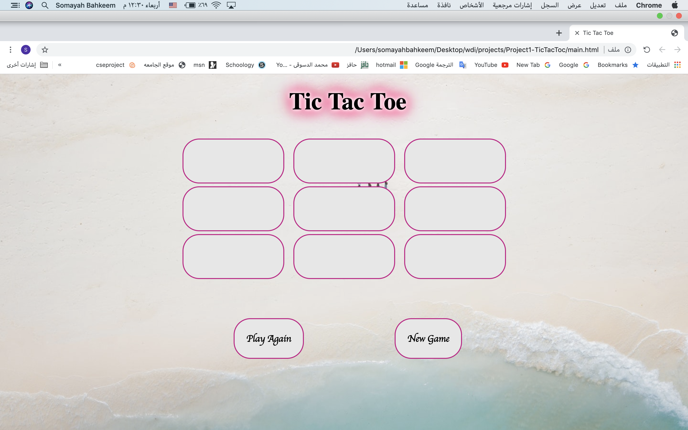
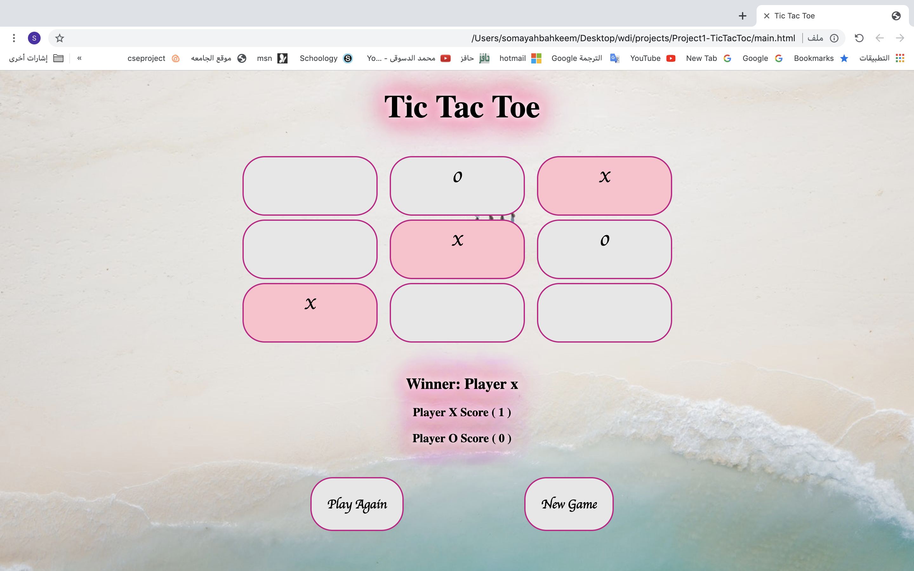
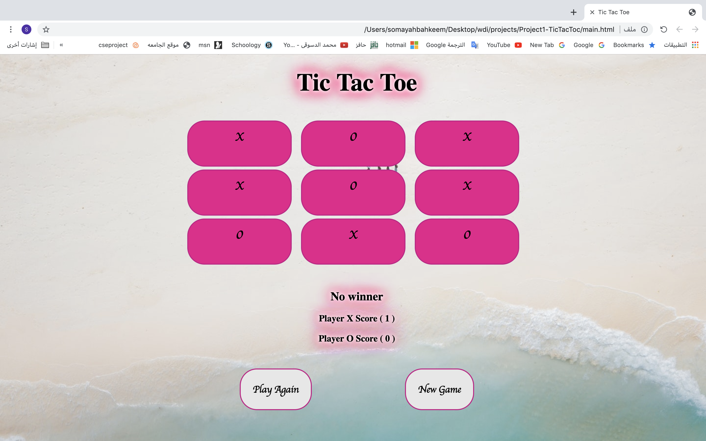
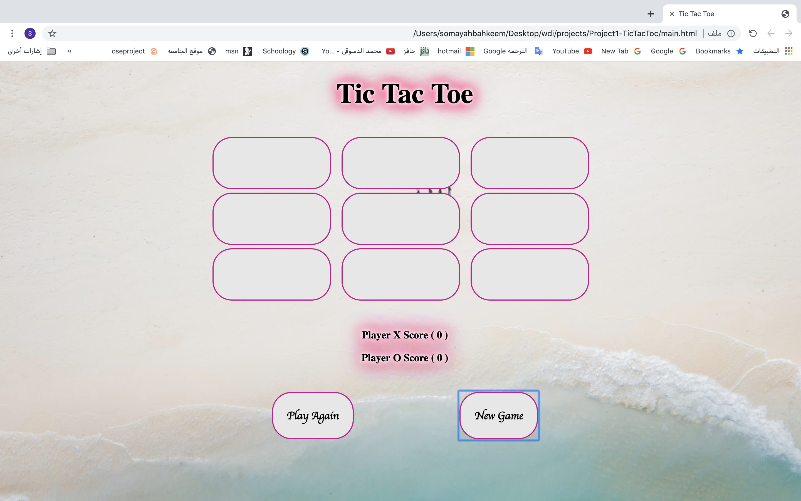

# Project1-TicTacToc

- List technologies used:
   I used Html5 , css3  , javaScript , Jquery

 -------------------------------------------------------------------------------------  
- Link to wireframes and user stories:

 ------------------------------------------------------------------------------------- 
- Document your planning and tell a story about your development process and problem-solving strategy:
      1-First step creat html ,css and javaScript file in the terminal
      2- link the files with html.
      3-next start with html and css .
      3-than the javaScript.
      4-stared with the bouns qustion.
      5-try to change some style and cheek the game it is ok or not in all case.

 ------------------------------------------------------------------------------------- 
- List unsolved problems which would be fixed in future iterations:
     I have no unsolved problems tell now but in the future I want to add many new things like: one player , give the user option start with X or O and add sound to the winner and loser.

 ------------------------------------------------------------------------------------- 
- Describe how you solved for the winner:
     I used if statment to find the win , winner and count the scoure also I creat a function to take the input from the user X or O.

 ------------------------------------------------------------------------------------- 
- Describe how some of your favorite functions work:

   I did a nice Tic Tac Toc Game with some additional things like:
   1-Play Agin
        I did this part using function calld playAgin to restart the borde with the same scoure to play agin.
   2-New Game
        I did this part using function calld newGame to restart the all page  to start New game with new scoure.
   3-Scoure
        I did this part to count the winner scoure    
   4-responsive
        I did this part to play the game in Desktop ,tap or in the phone.

 ------------------------------------------------------------------------------------- 